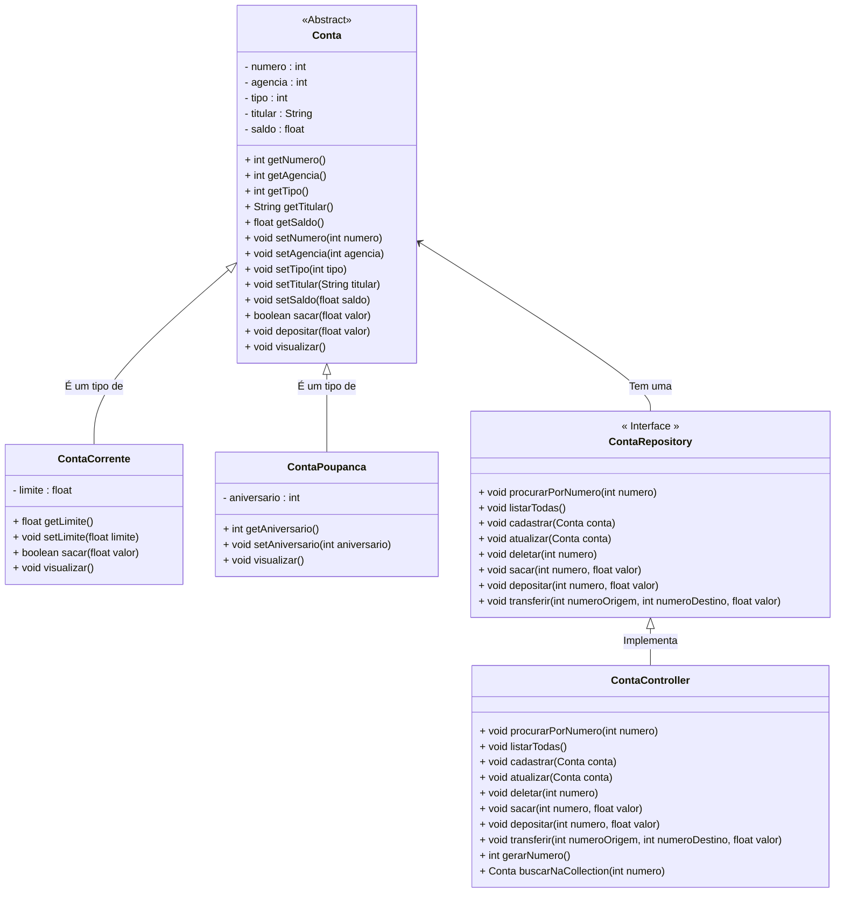

<h1 align = "center">Olá ! Este é um projeto em Java que simula uma Conta Bancária.</h1>
Este projeto foi criado com a intenção de aplicar meus conhecimentos em java, práticar orientação objetos e desenvolver minhas competências. 

Este sistema segue o seguinte diagrama: 
  

 

Desta forma pude trabalhar diversos conceitos como: Encapsulamento; Polimorfismo; Herança; Interfaces; POO; Collections; Entre alguns outros.

